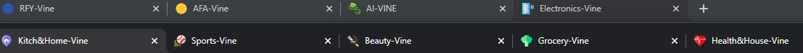

# vine-tabs-chrome

## what is this?
A collection of settings I find useful to relabel my Amazon Vine tabs in Chrome

## is it complete?
nope. just the ones I've prioritized so far.

## how do i implement this?
- Install the Chrome extension [Tab Modifier](https://chrome.google.com/webstore/detail/tab-modifier/hcbgadmbdkiilgpifjgcakjehmafcjai) 
([doc](https://github.com/sylouuu/chrome-tab-modifier))
- Download the file [settings/tab_modifier.json](https://github.com/ohmonster/vine-tabs-chrome/blob/main/settings/tab_modifier.json) to your computer
- Use the Tab Modifier settings page in Chrome to import the file
  
## where are the icons from?

They use the [Basic Stright Flat](https://www.flaticon.com/authors/basic-straight/flat?author_id=1&type=standard) collection by Freepik on the site flaticon.

You won't see image urls when you look at the settings, you'll see data uris.

## i want different cute pictures--how do I get a different data uri?

These instructions assume you're snagging images from the web.

In Chrome
- Right click on an image and select **Inspect**
- In the developer tools view, right click the image URL
- Select **Reveal in Sources panel**
- Right click the image shown in Resources
- Select **Copy image as data URI**